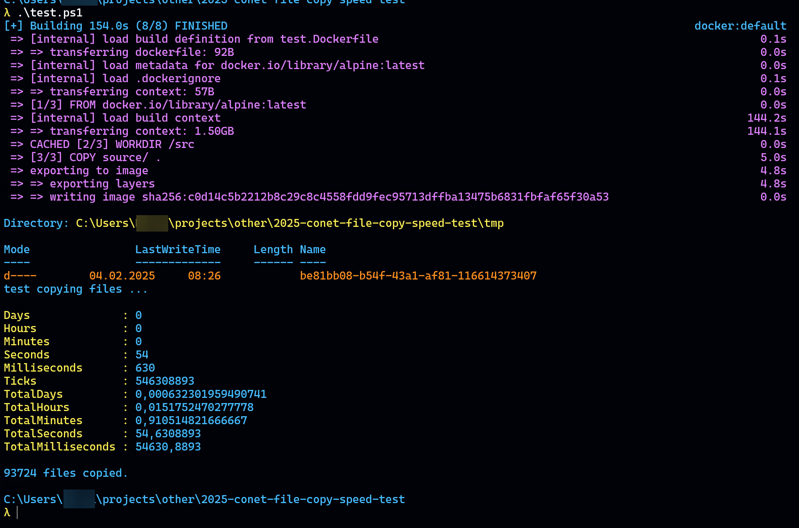

# Speed test - copy files Windows 
The following test uses the Linux kernel (90,000 files) and measures the time it takes to copy these files.

## How to

**Windows**:
```powershell
$ ./test.ps1
```

**Linux / WSL:**
```bash
$ ./test.sh
```

Expected output:


This shows the time it takes to copy the files to a Docker image and how long it takes to copy those files to disk.

## Cleanup
```
$ rm -R tmp
$ docker buildx prune -f
```
